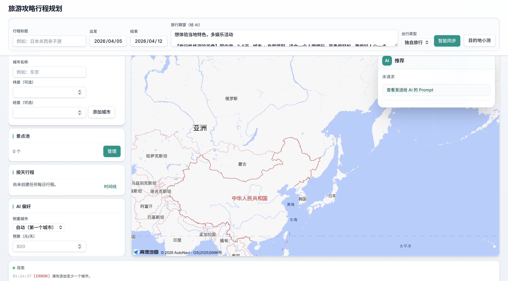

<div align="center">

# 行程规划助手 · Trip Planner

**用自然语言描述旅行期望，结合高德地图 POI 与 LLM，整理城市、景点与路线。**

[](https://nodejs.org/)
[](https://vitejs.dev/)
[](https://react.dev/)


</div>

---

## 界面预览

将截图保存到 `docs/screenshots/`，再在下面引用即可（以下为排版留白与示例路径）。

<br/>
<br/>
<br/>

| 建议文件名 | 内容 |
| :--- | :--- |
| `docs/screenshots/01-main.png` | 主界面：顶栏 + 左侧面板 + 地图 |
| `docs/screenshots/02-spot-pool.png` | 景点池弹层（可选） |
| `docs/screenshots/03-timeline.png` | 按天行程时间线（可选） |

引用示例（放入图片后取消注释或直接使用）：

```markdown

```

<br/>
<br/>
<br/>

---

## ✨ 功能概览

| | |
| :--- | :--- |
| **行程草稿** | 填写标题、日期、旅行期望；顶栏 **智能同步** 会重画地图、做合理性检查并请求 AI |
| **城市与景点** | 添加城市、从景点池选点，支持地图与路线规划 |
| **高德数据** | 后端代理 [高德开放平台](https://lbs.amap.com/) POI 搜索与详情（需 Key） |
| **AI 能力** | 兼容 OpenAI 格式的 LLM（默认 DeepSeek），攻略推荐与自然语言 → POI 参数分两条 API |

前端为 **React + Vite + Tailwind CSS**，由 **Express** 提供 `/api` 并与静态资源 **同源**（生产环境）或 **开发时通过 Vite 代理**。

---

## AI 使用方式与设计理念

### 设计理念

1. **单一上下文**  
   每次调用 `/api/ai/recommend` 时，前端会把当前能表达在应用里的行程 **一次性写进 prompt**（见 `client/src/lib/aiPrompt.ts` 中的 `buildAiPrompt`）。模型应把这段文字视为 **唯一可信行程上下文**，不臆造未出现的航班号、精确起降时刻等。

2. **一个主入口，减少重复按钮**  
   顶栏 **「智能同步」** 依次执行：地图重绘 → 合理性检查（住宿是否齐、每天景点是否过紧等）→ 全量 AI 推荐。侧栏仅保留 **AI 偏好**（侧重城市、预算），不再单独放「只推景点 / 只推住宿」等重复按钮，避免同一套上下文被多次割裂请求。

3. **轻度被动更新**  
   修改行程（保存按天行程、调整顺序、从景点池变更等）后，会 **防抖约 1.5 秒** 再自动请求一次与「智能同步」相同的推荐流程，状态栏会提示行程已变更、将自动更新。无需为「刷新」再点浮层按钮。

4. **结构化输出**  
   `recommend` 要求模型只返回 JSON：`sections` 中含 `spots`（景点池）、`lodging`（住宿）、`other`（行程松紧、空档利用、注意事项等短提示）。`other` 用于可扫读的轻量建议；**精确「几小时空档」** 需要系统里存在可计算的时段数据（见下）。

5. **与 POI 查询分流**  
   **`/api/ai/recommend`**：长上下文 + 结构化攻略/建议。  
   **`/api/ai/poi-query`**：自然语言 → 高德搜索参数，供景点池里「按关键词搜 POI」等流程使用。二者职责不同，不要混为一谈。

### 每次「推荐」会带上哪些信息

- 行程标题、出发/结束日期、旅行期望、出行类型  
- 城市列表（顺序与坐标，若有）  
- 景点池全部景点（坐标与备注）  
- 按天行程：日期、城市、住宿、景点顺序  
- 侧栏 **侧重城市**、**预算（元/天）**

用户在「旅行期望」里自行写的航班、时段，会原样进入 prompt，模型可引用；**未写入上下文的时刻表不应被编造**。

### 局限与可扩展方向

- 当前数据模型以 **日期 + 按天顺序** 为主，**没有** 结构化航班起降、分段钟点交通。若要稳定输出「落地后有几小时可安排」「两段航班之间的空档去哪」，需要增加对应字段并纳入 `collectTripContext` / prompt，再视情况调节自动请求的频次与成本。

- 「按天行程」弹层中的 **单日 AI 补景点**（`extendDaySpotsByAI`）是 **针对某一天** 的补充请求，仍基于同一份行程上下文并附加「仅补当天」的说明，适合精细编辑时使用。

---

## 🚀 快速开始

### 环境要求

- [Node.js](https://nodejs.org/) **18+**（推荐当前 LTS）

### 安装与开发

```bash
git clone <你的仓库地址>
cd trip-planner
npm install
cd client && npm install && cd ..
cp .env.example .env
# 编辑 .env：LLM_API_KEY、AMAP_KEY（后端高德 Web 服务）
# 编辑 client/.env：VITE_AMAP_KEY（前端地图 JS API，可与后端同应用）
npm run dev
```

- **后端 API**：<http://localhost:3001>
- **前端界面**：<http://localhost:5173>（通过代理访问 `/api`，与旧版「单端口」开发体验等价）

### 生产构建与启动

```bash
npm run build
NODE_ENV=production npm start
```

浏览器访问：**http://localhost:3001**（由 `server.js` 托管 `client/dist` 与 API）。

---

## 🔐 环境变量

### 项目根目录 `.env`（后端）

| 变量 | 必填 | 说明 |
| :--- | :---: | :--- |
| `LLM_API_KEY` | **建议** | 大模型 API Key（OpenAI 兼容接口，如 DeepSeek、豆包等） |
| `AMAP_KEY` | **建议** | [高德开放平台](https://console.amap.com/) Key，需开通 **「Web 服务」** |
| `LLM_BASE_URL` | 否 | 默认 `https://api.deepseek.com/v1` |
| `LLM_MODEL` | 否 | 默认 `deepseek-chat` |
| `PORT` | 否 | 服务端口，默认 `3001` |

### `client/.env`（前端地图）

| 变量 | 必填 | 说明 |
| :--- | :---: | :--- |
| `VITE_AMAP_KEY` | **建议** | 高德 **Web 端（JS API）** Key，用于浏览器加载地图脚本 |

可将 `client/.env.example` 复制为 `client/.env` 后填写。

---

## 🧩 技术栈

| 层级 | 技术 |
| :--- | :--- |
| 前端 | React 19 · Vite 8 · TypeScript · Tailwind CSS v4 · Zustand |
| 后端 | Node.js · Express · CORS · dotenv · node-fetch |
| 地图 | 高德地图 JS API 2.0 |

---

## 📡 后端 API 摘要

| 方法 | 路径 | 说明 |
| :--- | :--- | :--- |
| `POST` | `/api/ai/recommend` | 根据用户 `prompt` 返回结构化攻略 `sections`（JSON） |
| `POST` | `/api/ai/poi-query` | 自然语言 → 高德 POI 搜索参数 |
| `GET` | `/api/amap/poi` | 高德关键词搜索（代理，需 `AMAP_KEY`） |
| `GET` | `/api/amap/poi/detail` | 高德 POI 详情（代理，需 `AMAP_KEY`） |

---

## 📁 目录结构

```
trip-planner/
├── server.js              # Express 入口与 API
├── docs/screenshots/      # README 界面截图（见「界面预览」）
├── client/
│   ├── index.html
│   ├── vite.config.ts     # 开发代理 /api → localhost:3001
│   ├── src/
│   │   ├── App.tsx
│   │   ├── components/    # 页面与弹层
│   │   ├── store/         # Zustand 行程状态
│   │   └── lib/           # 纯函数：Prompt、地理计算等
│   └── package.json
├── package.json           # 根脚本：dev / build / start
├── .env.example
└── README.md
```

---

## 📄 许可证

MIT
