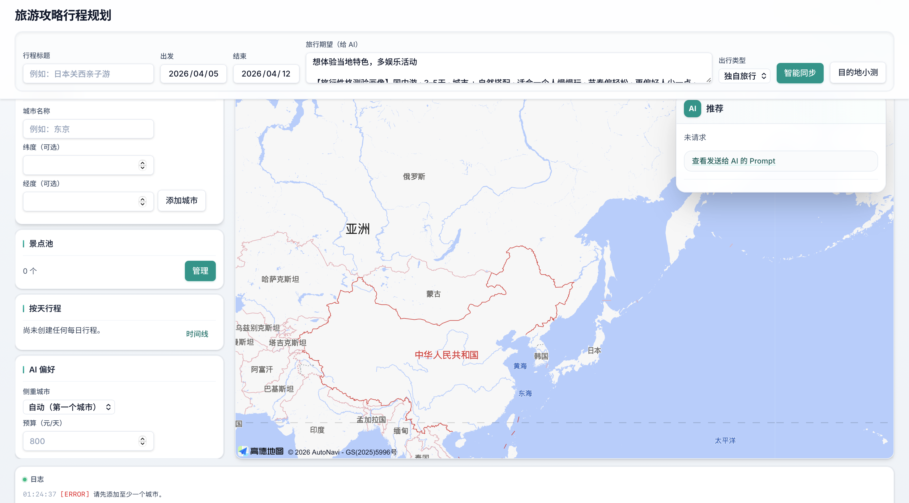

<div align="center">


# Trip Planner

**地图为核，AI 起步，你来拍板。**

[](https://react.dev/)
[](https://www.typescriptlang.org/)
[](#技术栈)
[](LICENSE)

[在线体验](https://kaiannn.github.io/trip-planner) · [本地跑通](#-快速开始) · [设计思路](#-设计思路) · [部署](#-部署)

</div>

---

<p align="center">
  
</p>

## 设计思路

核心想法：**地图就是界面**。

AI 负责起点 —— 你说"杭州 4 天，喜欢安静的地方"，它给你一批候选景点，高德自动地理编码打到地图上。然后你看着地图拖拖拽拽，把景点安排到每一天，行程是自己调出来的。

AI 不替你做决定，只是帮你不从零开始。

### 工作流

两步，没有第三步：

```
① Collect（景点池）                              ② Arrange（按天安排）

  "杭州 4 天，和伴侣，                              把池子里的景点
   喜欢安静的地方"                                   拖到任意一天
        │                                                │
        ▼                                                ▼
  ┌─────────────┐                                  ┌─────────────┐
  │  AI 返回     │                                  │  每天一张卡片 │
  │  10-20 个    │                                  │  拖进去就行   │
  │  候选景点    │                                  │              │
  └──────┬──────┘                                  │  地图自动画路线│
         │                                         │  自动算距离    │
         ▼                                         │  自动查天气    │
  高德地理编码                                       └─────────────┘
  → 地图上打点
  → 丢进景点池
```

景点不是 AI 单方面拍板的。你能手动加、改、删，能右键地图任意位置"添加为景点"，能从高德搜关键词。**AI 只是个起点，你才是行程的作者。**

---

## 功能

| 功能 | 说明 |
|---|---|
| **AI 填景点池** | 描述你的行程 → AI 返回候选 → 高德地理编码 → 地图打点。基于完整行程上下文推荐 |
| **每段路线独立交通** | 同一天里 A→B 开车、B→C 步行、C→D 地铁，各自调用对应的高德路线服务 |
| **三种景点类型** | 景点 / 酒店 / 餐厅，各自字段不同（餐厅有链接，酒店有价格） |
| **景点照片** | 浏览器端 canvas 缩到 1280px、JPEG 0.8，存 IndexedDB |
| **天气** | 每天卡片可选显示天气（高德 Weather，实测 ≤4 天预报） |
| **SSE 流式推荐** | AI 推荐边生成边渲染，不用等全部返回 |
| **持久化** | Zustand persist 到 localStorage，刷新不丢 |
| **目的地小测** | 没头绪时点一下，生成旅行画像写进 AI 期望 |
| **Demo 数据** | 内置杭州 3 天示例，点一下就能体验完整流程 |

### 已知限制

- LLM key 缺失时，AI 功能静默失败 —— 但手动操作完整可用
- 天气预报超过 4 天没有数据，远期天气 chip 会安静消失
- AI 偶尔推荐高德定位不到的虚构地名 —— 直接跳过

---

## 快速开始

```bash
git clone https://github.com/kaiannn/trip-planner.git
cd trip-planner
npm install --prefix client
npm run dev --prefix client
```

打开 http://localhost:5173，首次会弹出设置面板，填入：

- **LLM API Key** — DeepSeek 或任意 OpenAI 兼容接口
- **高德 Web 服务 Key** — 高德开放平台 → 应用管理 → 添加 Key → 服务平台选「Web 服务」

所有 Key 仅保存在浏览器本地，不会上传到任何服务器。

> 高德地图还需要一个 JS API Key。本地开发时填到 `client/.env` 的 `VITE_AMAP_KEY`；GitHub Pages 部署时通过 GitHub Secrets 注入。

---

## 部署

项目是纯前端，没有后端。部署到任何静态托管即可。

### GitHub Pages（在线体验）

> **https://kaiannn.github.io/trip-planner**

每次 push to main 自动部署。需要在 repo Settings → Secrets 添加 `VITE_AMAP_KEY`。

### Docker

```bash
docker compose up --build
# → http://localhost:8080
```

### 任意静态托管

```bash
npm install --prefix client
npm run build --prefix client
# 产物在 client/dist/，上传到 Vercel / Netlify / Cloudflare Pages 即可
```

---

## 项目结构

```
trip-planner/
├── client/src/
│   ├── components/            # UI 组件
│   │   └── map/               # 地图 hooks + 子组件
│   ├── store/
│   │   ├── slices/            # Zustand slices（ui / tripCore / ai / amapPoi / quiz）
│   │   ├── logStore.ts        # 独立日志 store
│   │   └── index.ts           # compose → useTripStore
│   ├── lib/                   # 纯函数（aiPrompt / geo / amapRouting / imageStorage）
│   ├── api/                   # LLM + 高德 API 直调（ai.ts / amap.ts）
│   ├── map/                   # AMap 类型声明 + MapContext
│   └── types.ts               # 全局类型
├── .github/workflows/         # CI + Pages 部署
└── docs/screenshots/
```

---

## 技术栈

| 层 | 技术 |
|---|---|
| 前端 | React 19 + TypeScript |
| 构建 | Vite |
| 样式 | Tailwind CSS v4 |
| 状态 | Zustand + persist |
| 拖拽 | @dnd-kit |
| 地图 | 高德 JS API 2.0（路线 / 地理编码 / 天气 / POI 搜索） |
| AI | DeepSeek / OpenAI 兼容，浏览器直调，SSE 流式 + 指数退避重试 |
| 测试 | Vitest（35 tests） |

---

## License

[MIT](LICENSE)
